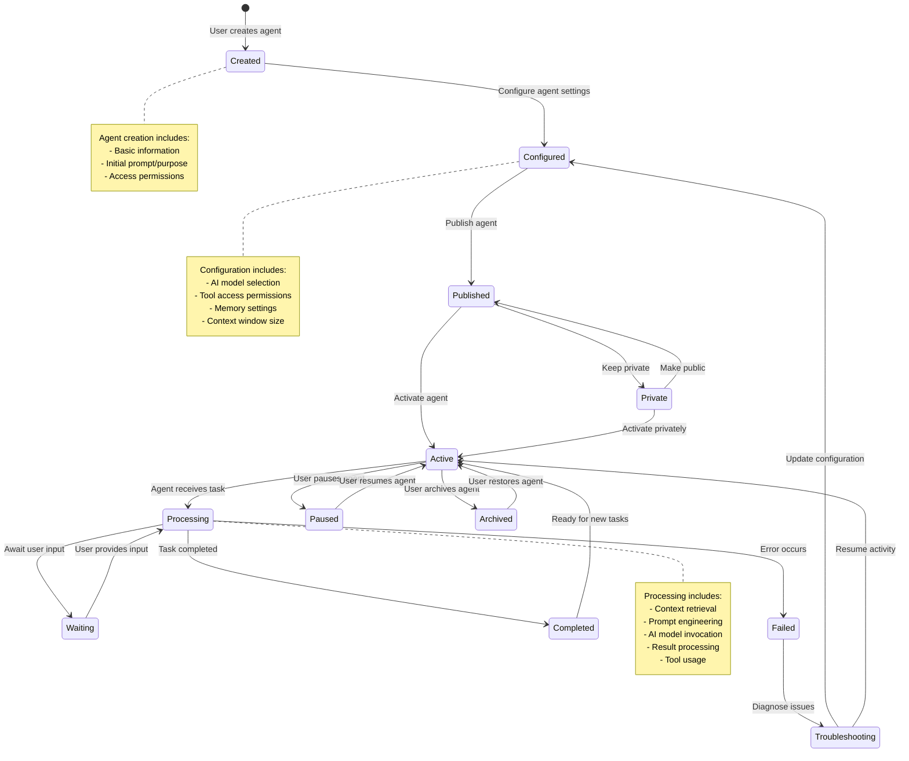

# Agent Lifecycle Diagram

This diagram visualizes the lifecycle of an agent in the FeNAgO platform, from creation to execution and monitoring.

This diagram illustrates:

1. The complete lifecycle of an agent from creation to archival
2. The different states an agent can be in
3. The transitions between states based on user actions and system events
4. The processes involved in agent configuration and execution
