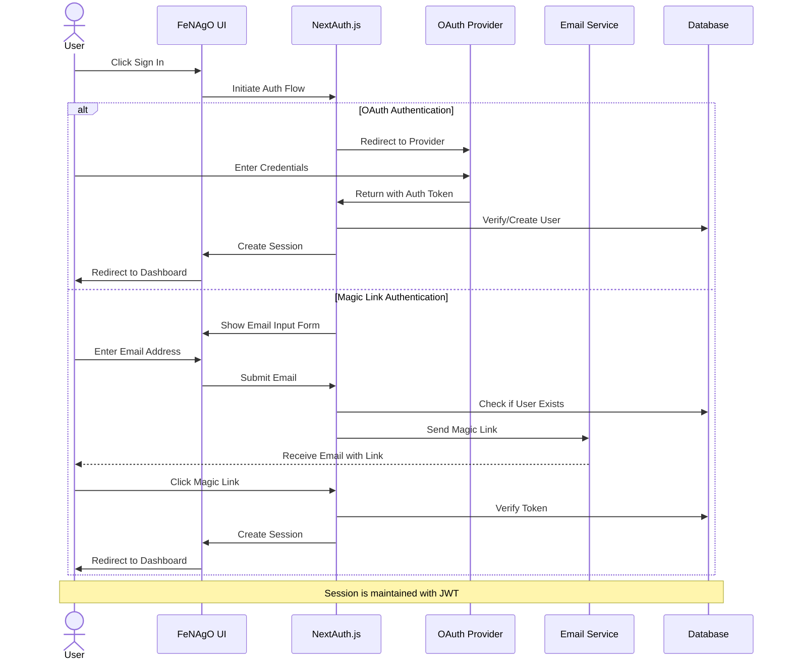

# Authentication Flow Diagram

This diagram illustrates the authentication process in the FeNAgO platform, showing the flow for both OAuth and Magic Link authentication methods.

This diagram illustrates:

1. Two authentication paths: OAuth and Magic Link
2. The interaction between the user and various system components
3. The creation and verification of user accounts
4. Session establishment after successful authentication
