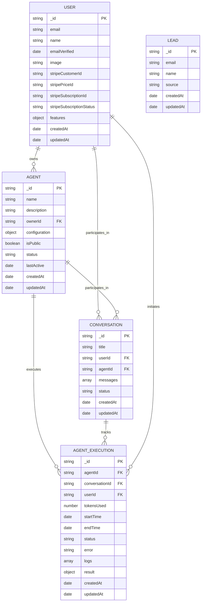

# Database Schema Diagram

This diagram visualizes the database schema for the FeNAgO platform, showing the collections and their relationships.

This diagram illustrates:

1. The core data models in the FeNAgO platform
2. The fields within each collection
3. The relationships between different collections
4. Primary keys (PK) and foreign keys (FK) showing connections
