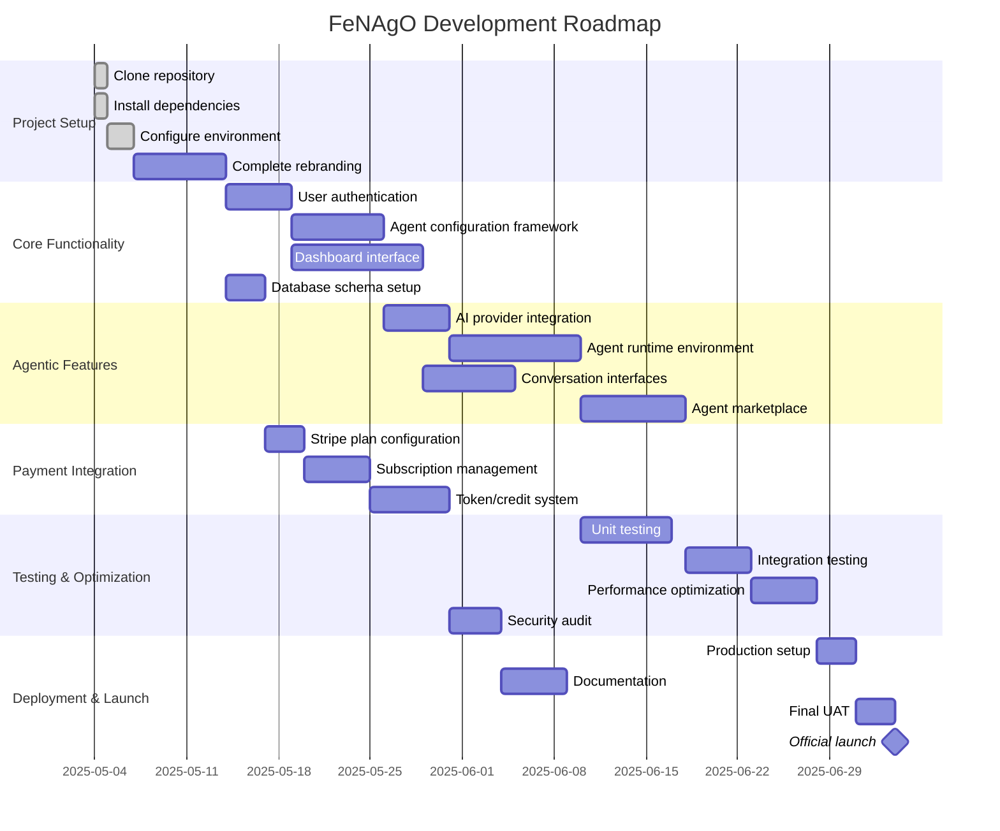

# Development Roadmap Diagram

This diagram visualizes the FeNAgO development roadmap, showing the phases, key milestones, and dependencies.

This diagram illustrates:

1. The six phases of development (matching the development plan)
2. Timeline for individual tasks within each phase
3. Dependencies between tasks across different phases
4. Current progress (completed items marked 'done')
5. Final launch milestone
