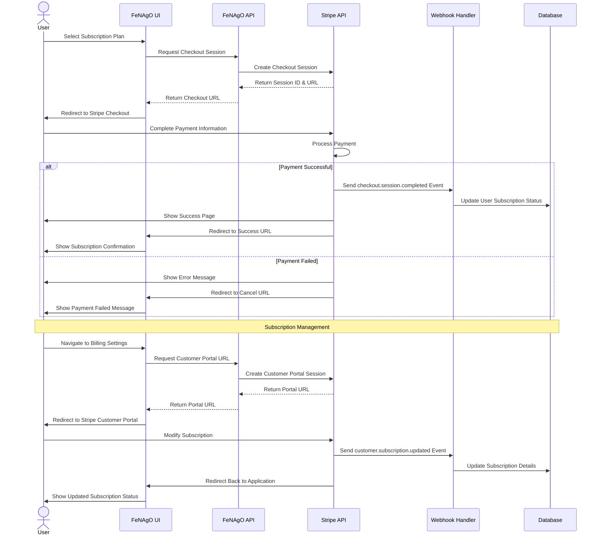

# Payment and Subscription Flow Diagram

This diagram visualizes the payment and subscription process within the FeNAgO platform, showing the interactions between the user, application, and Stripe.

This diagram illustrates:

1. The initial subscription process from plan selection to payment
2. Webhook handling for successful and failed payments
3. The subscription management process through Stripe Customer Portal
4. Database updates reflecting subscription changes
