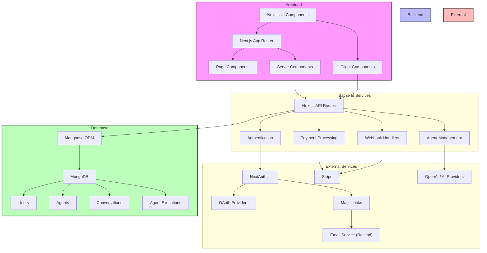

# System Architecture Diagram

This diagram illustrates the high-level architecture of the FeNAgO platform, showing how the different components interact.

This diagram shows:

1. The frontend components and their interactions
2. The backend API routes and services
3. External service integrations (OAuth, Stripe, OpenAI)
4. Database structure and collections
5. The flow of data between these components
